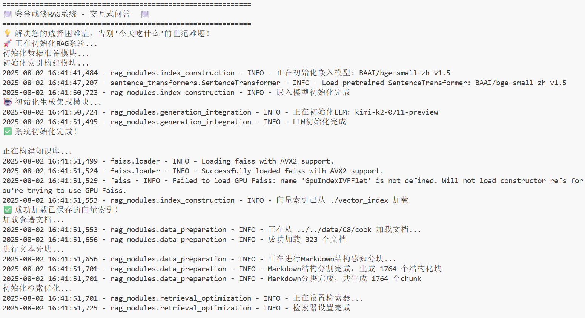

# Large Model Application Development Practice: RAG Technology Full-Stack Guide


[中文](/) | English

This project is a comprehensive RAG (Retrieval-Augmented Generation) technology full-stack tutorial for large model application developers. It aims to help developers master RAG application development skills based on large language models through systematic learning paths and hands-on practice projects, building production-grade intelligent Q&A and knowledge retrieval systems.

**Main content includes:**

1. **RAG Technology Fundamentals**: In-depth introduction to RAG core concepts, technical principles, and application scenarios
2. **Complete Data Processing Pipeline**: From data loading, cleaning to text chunking - the complete data preparation process
3. **Index Construction and Optimization**: Vector embedding, multimodal embedding, vector database construction and index optimization techniques
4. **Advanced Retrieval Techniques**: Hybrid retrieval, query construction, Text2SQL and other advanced retrieval technologies
5. **Generation Integration and Evaluation**: Formatted generation, system evaluation and optimization methods
6. **Project Practice**: Complete RAG application development practice from basic to advanced

## Project Significance

With the rapid development of large language models, RAG technology has become the core technology for building intelligent Q&A systems and knowledge retrieval applications. However, existing RAG tutorials are often scattered and lack systematicity, making it difficult for beginners to form a complete understanding of the technical system.

Starting from practice and combining the latest RAG technology development trends, this project builds a complete RAG learning system to help developers:
- Systematically master the theoretical foundation and practical skills of RAG technology
- Understand the complete architecture of RAG systems and the role of each component
- Develop the ability to independently develop RAG applications
- Master evaluation and optimization methods for RAG systems

## Target Audience

**This project is suitable for the following groups:**
- Developers with Python programming foundation who are interested in RAG technology
- AI engineers who want to systematically learn RAG technology
- Product developers who want to build intelligent Q&A systems
- Researchers with learning needs for retrieval-augmented generation technology

**Prerequisites:**
- Master Python basic syntax and usage of common libraries
- Ability to use Docker simply
- Understanding of basic LLM concepts (recommended but not required)
- Basic Linux command line operation skills

## Project Highlights

1. **Systematic Learning Path**: From basic concepts to advanced applications, building a complete RAG technology learning system
2. **Theory and Practice Combined**: Each chapter includes theoretical explanation and code practice to ensure learning and application
3. **Multimodal Support**: Covers not only text RAG, but also multimodal embedding and retrieval technologies
4. **Engineering-Oriented**: Focus on engineering problems in practical applications, including performance optimization, system evaluation, etc.
5. **Rich Practical Projects**: Provides multiple practical projects from basic to advanced to help consolidate learning outcomes

## Content Outline

### Part I: RAG Fundamentals

**Chapter 1 Unlocking RAG** [📖 View Chapter](en/chapter1)
1. [x] [RAG Introduction](en/chapter1/01_RAG_intro.md) - RAG technology overview and application scenarios
2. [x] [Preparation](en/chapter1/02_preparation.md) - Environment configuration and tool preparation
3. [x] [Four Steps to Build RAG](en/chapter1/03_get_start_rag.md) - Quick start with RAG development

**Chapter 2 Data Preparation** [📖 View Chapter](en/chapter2)
1. [x] [Data Loading](en/chapter2/04_data_load.md) - Multi-format document processing and loading
2. [x] [Text Chunking](en/chapter2/05_text_chunking.md) - Text segmentation strategies and optimization

### Part II: Index Construction and Optimization

**Chapter 3 Index Construction** [📖 View Chapter](en/chapter3)
1. [x] [Vector Embedding](en/chapter3/06_vector_embedding.md) - Detailed explanation of text vectorization technology
2. [x] [Multimodal Embedding](en/chapter3/07_multimodal_embedding.md) - Image-text multimodal vectorization
3. [x] [Vector Database](en/chapter3/08_vector_db.md) - Vector storage and retrieval systems
4. [x] [Milvus Practice](en/chapter3/09_milvus.md) - Milvus multimodal retrieval practice
5. [x] [Index Optimization](en/chapter3/10_index_optimization.md) - Index performance tuning techniques

### Part III: Advanced Retrieval Techniques

**Chapter 4 Retrieval Optimization** [📖 View Chapter](en/chapter4)
1. [x] [Hybrid Search](en/chapter4/11_hybrid_search.md) - Dense + sparse retrieval fusion
2. [x] [Query Construction](en/chapter4/12_query_construction.md) - Intelligent query understanding and construction
3. [x] [Text2SQL](en/chapter4/13_text2sql.md) - Natural language to SQL query
4. [x] [Query Rewriting and Routing](en/chapter4/14_query_rewriting.md) - Query optimization strategies
5. [x] [Advanced Retrieval Techniques](en/chapter4/15_advanced_retrieval_techniques.md) - Advanced retrieval algorithms

### Part IV: Generation and Evaluation

**Chapter 5 Generation Integration** [📖 View Chapter](en/chapter5)
1. [x] [Formatted Generation](en/chapter5/16_formatted_generation.md) - Structured output and format control

**Chapter 6 RAG System Evaluation** [📖 View Chapter](en/chapter6)
1. [x] [Evaluation Introduction](en/chapter6/18_system_evaluation.md) - RAG system evaluation methodology
2. [x] [Evaluation Tools](en/chapter6/19_common_tools.md) - Common evaluation tools and metrics

### Part V: Advanced Applications and Practice

**Chapter 7 Advanced RAG Architecture (Extended Elective)** [📖 View Chapter](en/chapter7)

1. [x] [Knowledge Graph-based RAG](en/chapter7/20_kg_rag.md)

**Chapter 8 Project Practice I (Basic)** [📖 View Chapter](en/chapter8)
1. [x] [Environment Configuration and Project Architecture](en/chapter8/01_env_architecture.md)
2. [x] [Data Preparation Module Implementation](en/chapter8/02_data_preparation.md)
3. [x] [Index Construction and Retrieval Optimization](en/chapter8/03_index_retrieval.md)
4. [x] [Generation Integration and System Integration](en/chapter8/04_generation_sys.md)

**Chapter 9 Project Practice I Optimization (Elective)** [📖 View Chapter](en/chapter9)

[🍽️ Project Demo](https://github.com/FutureUnreal/What-to-eat-today)
1. [x] [Graph RAG Architecture Design](en/chapter9/01_graph_rag_architecture.md)
2. [x] [Graph Data Modeling and Preparation](en/chapter9/02_graph_data_modeling.md)
3. [x] [Milvus Index Construction](en/chapter9/03_index_construction.md)
4. [x] [Intelligent Query Routing and Retrieval Strategy](en/chapter9/04_intelligent_query_routing.md)

**Chapter 10 Project Practice II (Elective)** [📖 View Chapter](en/chapter10) *In Planning*

## Directory Structure

```
all-in-rag/
├── docs/           # Tutorial documentation
├── code/           # Code examples
├── data/           # Sample data
├── models/         # Pre-trained models
└── README.md       # Project description
```

## Practical Project Showcase

### Chapter 8 Project I:



### Chapter 9 Project I (Graph RAG Optimization):


---

## License

<a rel="license" href="http://creativecommons.org/licenses/by-nc-sa/4.0/"></a>

This work is licensed under a [Creative Commons Attribution-NonCommercial-ShareAlike 4.0 International License](http://creativecommons.org/licenses/by-nc-sa/4.0/).

---
